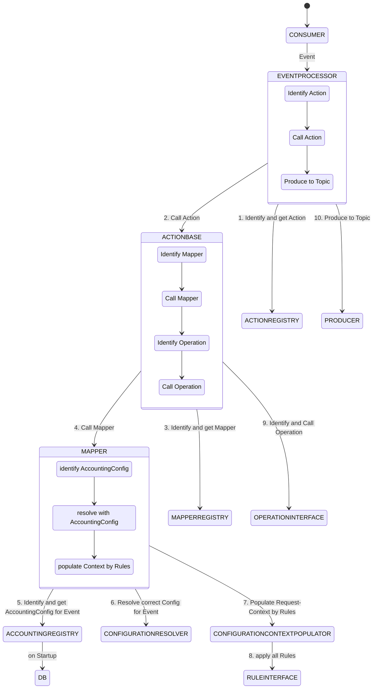

# kotlin-event-processor




Example AccountingConfiguration:

| QUERY                                                                    | ACCOUNT_ID | SIGN     | R/L/M | MPROCESS | SPROCESS | S_MACCOUNT | H_MACCOUNT | PRODUCTGROUP | INSURANCETYPE | STOCKTYPE | CLAIMTYPE | RISKTYPE | INSURANCETYPELONG           |
|--------------------------------------------------------------------------|------------|----------|-------|----------|----------|------------|------------|--------------|---------------|-----------|-----------|----------|-----------------------------|
| CONTRACTPART.SURPLUSAPPLICATIONTYPE == 1 && BENEFICIARY.RESERVEFUND > 0  | CUSTOMER   | POSITIVE | L     | 6200     | 0347     | 270605     | 401800     | LE           | 13            |           |           |          |                             |
| CONTRACTPART.SURPLUSAPPLICATIONTYPE == 1 && BENEFICIARY.SURPLUSSHARE > 0 | CUSTOMER   | POSITIVE | L     | 6200     | 0323     | 270605     | 270400     | LE           | 13            |           |           |          |                             |
| BENEFICIARY.FINALSURPLUSSHARE > 0                                        | CUSTOMER   | POSITIVE | L     | 6200     | 0321     | 270605     | 231100     | LE           | 13            |           |           |          |                             |
| BENEFICIARY.VALUATIONRESERVE > 0                                         | CUSTOMER   | POSITIVE | L     | 6200     | 0344     | 270605     | 401250     | LE           |               |           |           |          |                             |
| CONTRACTPART.SURPLUSAPPLICATIONTYPE == 4 && BENEFICIARY.RESERVEFUND > 0  | CUSTOMER   | POSITIVE | L     | 6200     | 0347     | 270605     | 401800     | LE           | 13            |           |           |          | CONTRACTPART.EXTERNALFUNDID |
| CONTRACTPART.SURPLUSAPPLICATIONTYPE == 4 && BENEFICIARY.SURPLUSSHARE > 0 | CUSTOMER   | POSITIVE | L     | 6200     | 0348     | 270605     | 461400     | LE           | 13            |           |           |          | CONTRACTPART.EXTERNALFUNDID |
| CONTRACT.SUBSIDYRECLAMATION > 0                                          | STATE      | POSITIVE | L     | 6200     | 0337     | 270605     | 301330     | LE           | 21            |           |           |          |                             |
| CONTRACT.TAXRECLAMATION > 0                                              | STATE      | POSITIVE | L     | 6200     | 0337     | 270605     | 301330     | LE           | 21            |           |           |          |                             |

Example Event:

```json
{
  "contractId": "7778881",
  "processingType": 322,
  "taxReclamation": 100,
  "subsidyReclamation": 100,
  "ratingGender": 1,
  "partnerIdPolicyHolder": "9000",
  "effectiveFrom": "01.08.25 00:00",
  "processingDate": "15.08.25 15:34",
  "productVariantType": 10019,
  "priceTier": 100001,
  "contractParts": [
    {
      "surplusApplicationType": 1,
      "legacyIndicator": 0,
      "statementGeneration": 100592,
      "externalFundId": 53,
      "rateVariantId": 100315,
      "beneficiary": [
        {
          "reserveFund": 100,
          "valuationReserve": 100,
          "surplusShare": 100,
          "finalSurplusShare": 100,
          "accountNumber": 1,
          "partnerId": "9000"
        }
      ]
    }
  ]
}
```
